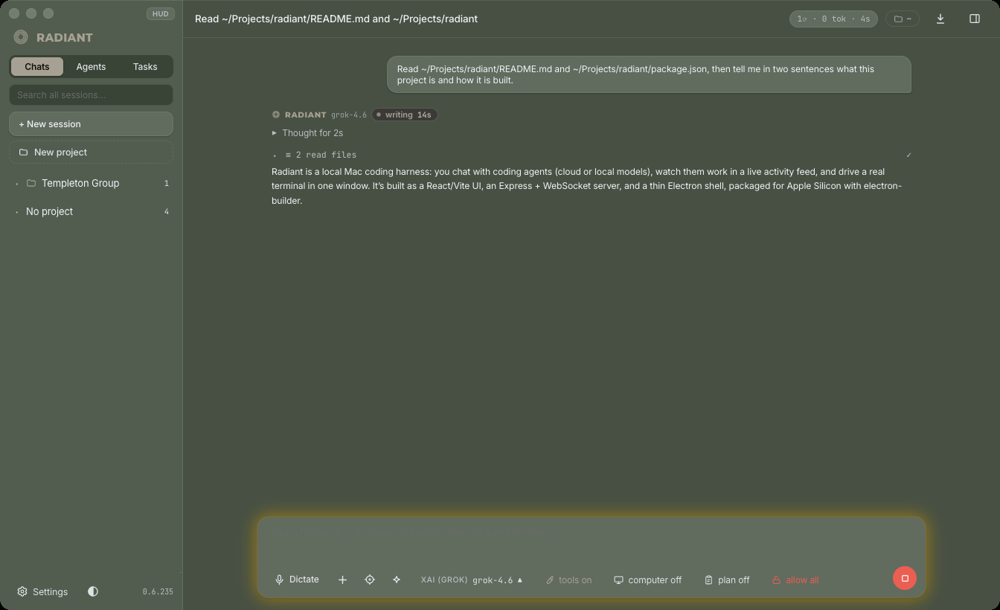
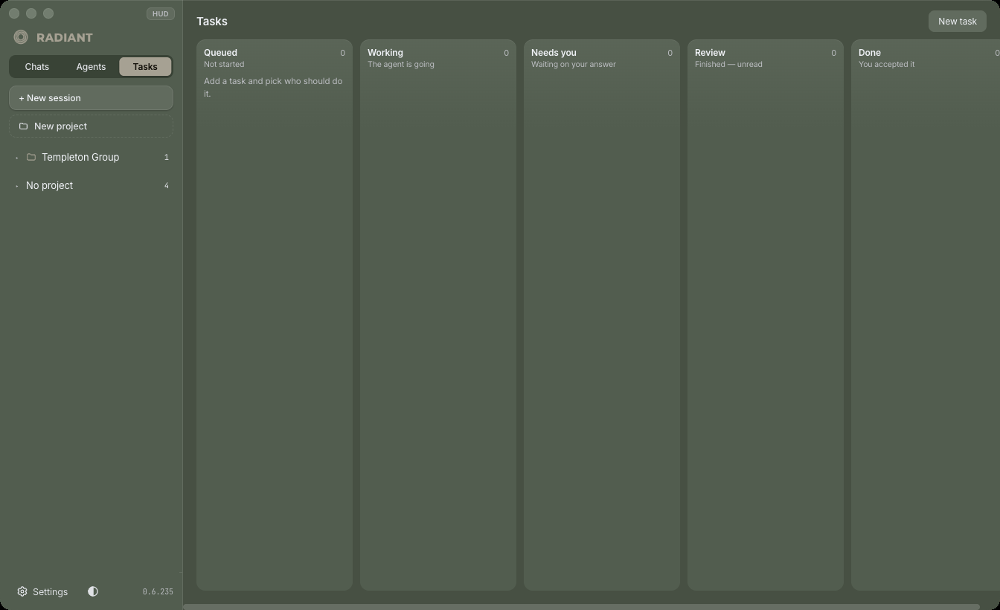

<p align="center">
  
</p>
<p align="center">
  
</p>

<p align="center">
  <strong>100% free and open source.</strong> MIT licensed — use it, modify it,
  redistribute it, sell it.
</p>

<p align="center">
  A local coding harness for your Mac: chat with coding agents across cloud and
  local models, watch them work in a live activity feed, and drive a real
  terminal — all in one window.
</p>

<p align="center">
  
</p>

<p align="center">
  <em>An agent working in a real folder — every file it touched is listed, and the
  composer shows which model is answering and what it is allowed to do.</em>
</p>

<p align="center">
  
</p>

<p align="center">
  <em>Longer jobs run as tasks. "Needs you" is the column that matters: an agent
  that hits a decision stops there instead of guessing.</em>
</p>

## Features

- **Agent chat** with streaming responses and visible model thinking
- **Any model, one history** — sessions store messages in a neutral format, so
  you can switch between Anthropic, OpenAI, OpenRouter, Ollama, and LM Studio
  mid-conversation and keep your context
- **Agent tools** — the model can list/read/write/edit files and run shell
  commands in a per-session workspace folder, with an approval prompt before
  every command (toggle in Settings)
- **Activity panel** — live feed of every tool call and its output
- **Terminal panel** — a real login shell (node-pty + xterm.js) in the sidebar
- **Theming** — light/dark, six presets, or a fully custom accent: the whole
  palette derives from one OKLCH hue + chroma pair
- **Private by design** — API keys are stored locally in
  `~/.radiant/config.json` (mode 0600) and never sent to the browser; the
  server binds to 127.0.0.1 only; local providers need no key at all
- **Custom providers** — add any OpenAI-compatible base URL (Groq, Mistral,
  Together, a remote Ollama box…)

## Install the Mac app

Grab `Radiant-<version>-arm64.dmg` from the releases (Apple Silicon), open it,
and drag Radiant into Applications.

The app is not signed by Apple, so on first launch macOS blocks it. Drag
Radiant to Applications, then **right-click Radiant → Open → Open** (or allow it
under System Settings → Privacy & Security → "Open Anyway"). You only do this
once.

If macOS says **"Radiant is damaged and can't be opened"**, that's Gatekeeper on
a downloaded unsigned app — the app is fine. Clear the quarantine flag once:

```bash
xattr -cr /Applications/Radiant.app
```

then open it normally. (Proper signing + notarization, which removes this step
entirely, is planned.)

Or build it yourself:

```bash
npm install
npm run dist        # produces release/Radiant-<version>-arm64.dmg
```

## Run from source (dev mode)

```bash
npm install
npm run dev         # server on :5834, UI with hot reload on http://localhost:5833
```

`npm run app` builds the UI and launches the Electron app without packaging.

## Using it

1. Start a session. If Ollama or LM Studio is running locally, a local model is
   picked automatically — no account, no key, nothing leaves your machine.
2. To use cloud models, open **⚙ Settings** and paste an API key next to a
   provider. The model picker (top right) lists every model you have access to.
3. Point the session's workspace folder (path chip in the top bar) at a
   project and ask the agent to build, fix, or explain something. It asks
   before running each shell command; file edits show up in the Activity panel.
4. The **▤** button toggles the side panel: Activity feed and Terminal.

## Architecture

- `server/` — Express + WebSocket backend: streaming provider clients
  (`providers.js`, Anthropic + OpenAI-compatible), agent tools (`tools.js`),
  config and session storage (`config.js`)
- `src/` — React UI (Vite): chat, model picker, settings, activity feed,
  xterm terminal
- `electron/` — thin Electron shell that boots the server in-process and
  opens a window on it

OAuth sign-in to providers is not implemented yet; the provider registry has an
`auth` field so a device-code/OAuth flow can slot in later.

## License

Radiant is a Templeton Technologies product, released under the
[MIT License](LICENSE).

In plain terms: use it, modify it, redistribute it, build on it, sell it —
commercially or otherwise. The only condition is that the copyright notice
travels with it. See [`LICENSE`](LICENSE) for the exact terms.

Radiant was previously under the Functional Source License (`FSL-1.1-MIT`),
which prohibited competing use. It is now MIT: fully open source by the Open
Source Definition, with no carve-out.

Copyright © 2026 Templeton Technologies.
