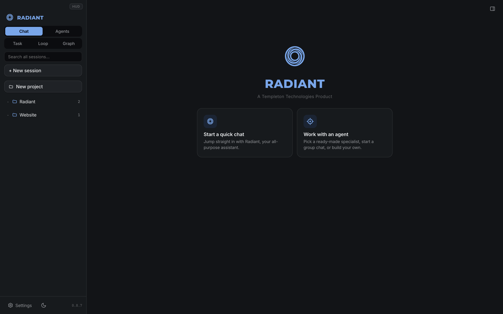
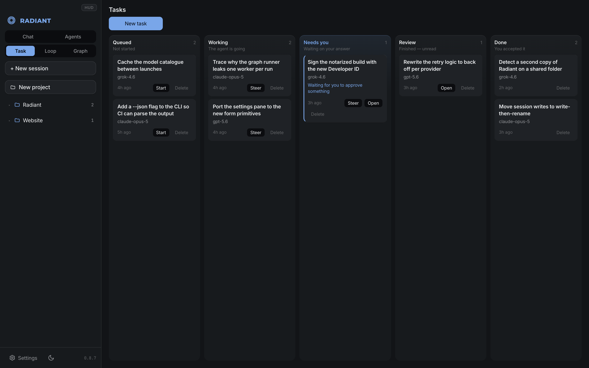
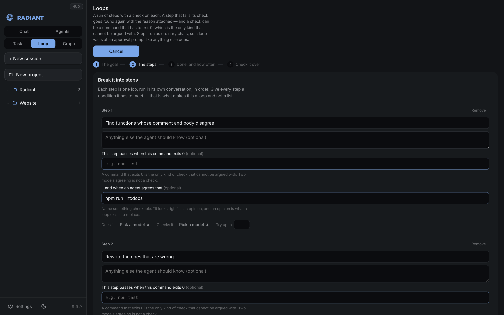
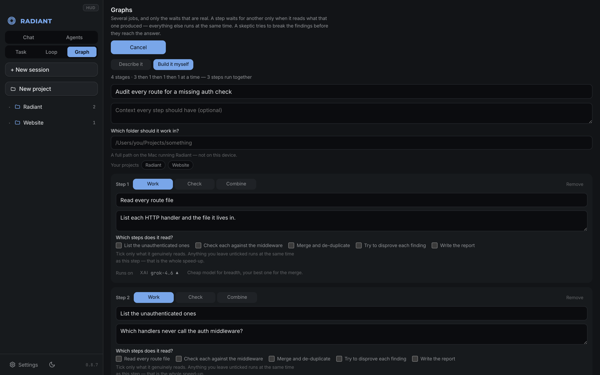
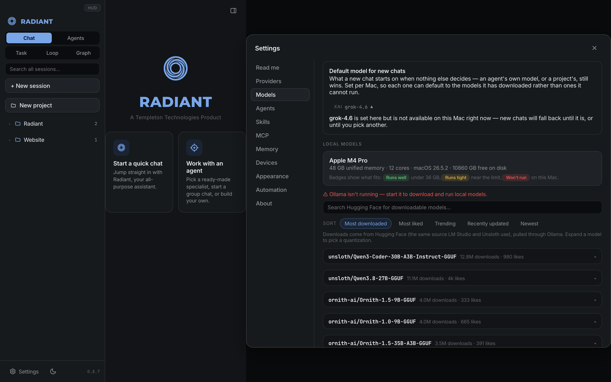

<p align="center">
  
</p>
<p align="center">
  
</p>

<p align="center">
  <strong>100% free and open source.</strong> MIT licensed — use it, modify it,
  redistribute it, sell it.
</p>

<p align="center">
  A local coding harness for your Mac: chat with coding agents across cloud and
  local models, watch them work in a live activity feed, and drive a real
  terminal — all in one window.
</p>

<p align="center">
  
</p>

<p align="center">
  <em>An agent working in a real folder — every file it touched is listed, and the
  composer shows which model is answering and what it is allowed to do.</em>
</p>

<p align="center">
  
</p>

<p align="center">
  <em>Longer jobs run as tasks. "Needs you" is the column that matters: an agent
  that hits a decision stops there instead of guessing.</em>
</p>

<p align="center">
  
</p>

<p align="center">
  <em>A loop is a run of steps that checks its own work. Each step carries a
  condition — a shell command that has to exit 0, or a sentence another agent
  judges — and a step that fails goes round again carrying the reason.</em>
</p>

<p align="center">
  
</p>

<p align="center">
  <em>A graph is several jobs and only the waits that are real. You tick what a
  step actually reads; everything left unticked runs at the same time. Here that
  is four stages, three of them running together.</em>
</p>

<p align="center">
  
</p>

<p align="center">
  <em>Local models are measured against the machine you are on, not a spec sheet
  — every one is labelled Runs well, Runs tight or Won't run before you spend the
  download.</em>
</p>

## Features

**Agents that do real work**

- **Agent chat** with streaming replies and visible model thinking, on any
  model: Anthropic, OpenAI, OpenRouter, xAI, Nous, Groq, Mistral and more, or
  Ollama and LM Studio on your own Mac. Sessions store messages in a neutral
  format, so you can switch models mid-conversation and keep your context.
- **Real tools** — read, write and edit files and run shell commands in the
  chat's project folder. Ask before every command, auto-run the low-risk ones
  (with a second opinion on each from a small decision model), or allow all.
- **Undo** — every reply that edits files leaves a checkpoint; roll the files
  back and keep the conversation.
- **Your project's rules** — Radiant reads a project's `AGENTS.md`,
  `CLAUDE.md`, `.clinerules` or `.cursorrules` into every chat, and shows the
  branch's pull request and CI status above the composer.
- **Reasoning carries between steps** — a model that thinks (Claude with a
  thinking level, ChatGPT models on a ChatGPT sign-in) gets its own earlier
  reasoning back at each tool step instead of starting over.
- **Sandbox commands** (optional) — macOS enforces a fence around every
  command the agent runs: writes only inside the project folder, and, if you
  choose, no internet. A blocked command tells the agent to ask you.
- **One message, one reply** — a message that arrives twice (a retried
  connection, a repeated voice request) runs once. A turn that stops for any
  reason says why in the chat, with a Continue button — never an empty reply.
- **Steer while it works** — messages typed mid-turn queue up; Steer stops the
  agent and sends them now. Stop keeps whatever was already written.

**Work that runs longer**

- **Task board** — a kanban board where the run moves the card: Queued,
  Working, Needs you (the moment the agent asks something), Review, Done.
  Click a task for a two-column view: its description and one feed of your
  comments, its history and every run with the tools it used on the left;
  status, priority, labels, due date and dependencies on the right. Tasks can
  wait on other tasks, and an agent can read the board, add subtasks and leave
  comments itself.
- **Loops** — a run of steps where each step has a check it must pass (a
  command that exits 0, or a sentence another agent judges); a step that fails
  goes round again carrying the reason. A check can also answer *blocked* —
  no attempt could pass — which ends the loop at once instead of spending
  the attempts left.
- **Graphs** — several jobs with only the waits that are real: steps that do
  not depend on each other run at the same time. A run shows what every step
  and round spent (tokens, and dollars at list price), and a repeating graph
  can stop at a token budget.
- **Long builds** — no cap on rounds. The only ceiling is a spend budget you
  set, measured in real cost, and a turn that keeps failing the same kind of
  command is stopped instead of burning tokens.
- **Long chats keep what matters** — past half the model's window, Jev sets
  aside older tool results the task no longer needs (and any result a later,
  identical call replaced), so what the task depends on keeps its place. When a
  chat outgrows its model, earlier exchanges about something else are set
  aside before anything is summarized — kept in the chat, just not sent.

**Models, chosen well**

- **Sign in with a subscription** you already pay for — Claude, ChatGPT, Grok,
  GitHub Copilot, Qwen or Nous Portal — or paste an API key.
- **The right model for each message** — easy messages can go to a fast model
  from the same provider, decided by Jev (a small decision model) in about 300
  ms. Or choose **Jev Router** at the top of OpenRouter's list and let it pick
  any model for each message; every reply is labeled with the model that
  actually answered.
- **Local models, measured against your Mac** — each one is labelled Runs
  well, Runs tight or Won't run before you download it.

**The workspace**

- **Activity panel** — a live feed of every tool call and its output, plus a
  Preview tab that shows what the agent makes.
- **Terminal panel** — a real login shell (node-pty + xterm.js).
- **Browser control from your own Chrome** — the
  [Radiant Browser Bridge](https://chromewebstore.google.com/detail/jhljglakgocklinpblgcoppljflnacfk)
  extension lets the agent read pages, click, and see the network calls a site
  makes, in the browser you are already signed into.
- **Voice** — hold a spoken conversation over any chat on OpenAI GPT-Live or
  Google Gemini Live; your own model, tools and approvals do the work.
- **Skills and MCP** — reusable skills globally or per agent, MCP tool
  servers attached only when a message needs them, and 142 ready-made agents.
- **Theming** — light, medium and dark, fourteen presets (Tokyo Night,
  Catppuccin, Everforest, Gruvbox, Nord, Dracula, Rosé Pine, Solarized and
  more), or your own background and text colors with the rest of the palette
  derived in OKLCH and a contrast check.
- **Private by design** — API keys live in `~/.radiant/config.json` (mode
  0600) and never reach the browser; the agent's shell runs without your
  secrets in its environment; the server binds to 127.0.0.1 unless you turn on
  sharing with your other Macs and phone, which is gated by an access token.

## Radiant for iPhone and iPad

[On the App Store](https://apps.apple.com/us/app/radiant-local-ai-chat/id6804891721). It runs open models
directly on the device with Apple's MLX — search Hugging Face, see whether a
model fits your device before you download it, and chat with nothing leaving
the phone. It also talks to Apple Intelligence and to cloud models with your
own key, which stays in the Keychain. The app is native SwiftUI; the source is in `apps/ios`.

## Install the Mac app

Download the latest
[Radiant for Mac](https://github.com/templetongroup/radiant/releases/latest/download/radiant.dmg)
(Apple Silicon), open it, and drag Radiant into Applications. It is signed and
notarized by Apple, so it opens like any other app, and it keeps itself up to
date.

Or build it yourself:

```bash
npm install
npm run dist        # produces release/Radiant-<version>-arm64.dmg
```

## Run from source (dev mode)

```bash
npm install
npm run dev         # server on :5834, UI with hot reload on http://localhost:5833
```

`npm run app` builds the UI and launches the Electron app without packaging.

## Using it

1. Start a session. If Ollama or LM Studio is running locally, a local model is
   picked automatically — no account, no key, nothing leaves your machine.
2. To use cloud models, open **⚙ Settings** and paste an API key next to a
   provider. The model picker (top right) lists every model you have access to.
3. Point the session's workspace folder (path chip in the top bar) at a
   project and ask the agent to build, fix, or explain something. It asks
   before running each shell command; file edits show up in the Activity panel.
4. The **▤** button toggles the side panel: Activity feed and Terminal.

## Architecture

- `server/` — Express + WebSocket backend: streaming provider clients
  (`providers.js`, Anthropic + OpenAI-compatible), agent tools (`tools.js`),
  config and session storage (`config.js`)
- `src/` — React UI (Vite): chat, model picker, settings, activity feed,
  xterm terminal
- `electron/` — thin Electron shell that boots the server in-process and
  opens a window on it

Subscription sign-in is implemented in `server/oauth.js` — device-code and PKCE
flows for Claude, ChatGPT, Nous Portal, xAI (Grok), Qwen and GitHub Copilot, so
you can use a plan you already pay for instead of an API key. The provider
registry's `auth` field is what each provider's flow is selected by.

## License

Radiant is a Templeton Technologies product, released under the
[MIT License](LICENSE).

In plain terms: use it, modify it, redistribute it, build on it, sell it —
commercially or otherwise. The only condition is that the copyright notice
travels with it. See [`LICENSE`](LICENSE) for the exact terms.

Radiant was previously under the Functional Source License (`FSL-1.1-MIT`),
which prohibited competing use. It is now MIT: fully open source by the Open
Source Definition, with no carve-out.

Copyright © 2026 Templeton Technologies.
